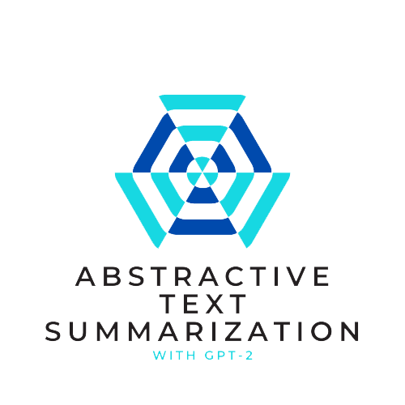

[![Contributors][contributors-shield]][contributors-url]
[![Forks][forks-shield]][forks-url]
[![Stargazers][stars-shield]][stars-url]
[![MIT License][license-shield]][license-url]
[![LinkedIn][linkedin-shield]][linkedin-url]

<!-- PROJECT LOGO -->
 

  

  <h3 align="center">Abstractive Text Summarization</h3>

  

    ...
     
    <a href="https://github.com/ogulcanertunc/Abstractive-Text-Summarization/tree/main/Thesis%20Documents"><strong>Explore the docs »</strong></a>
     
     
  

<!-- TABLE OF CONTENTS -->

  
Table of Contents

  <ol>
    <li>
      <a href="#about-the-project">About The Project</a>
      <ul>
        <li><a href="#built-with">Built With</a></li>
      </ul>
    </li>
    <li>
      <a href="#file-descriptions">File Descriptions</a>
    <li><a href="#usage">Usage</a></li>
    <li><a href="#roadmap">Roadmap</a></li>
          <ul>
        <li><a href="#methodology">Methodology</a></li>
        <li><a href="#summary-types">Summary Types</a></li>
        <li><a href="#model-architecture">Model Architecture</a></li>
        <li><a href="#pre-training-with-transfer-learning ">Pre Training with Transfer Learning</a></li>
      </ul>
    <li><a href="#license">License</a></li>
    <li><a href="#contact">Contact</a></li>
    <li><a href="#acknowledgements">Acknowledgements</a></li>
  </ol>

<!-- ABOUT THE PROJECT -->
## About The Project

[![Product Name Screen Shot][product-screenshot]](https://example.com)

Text Summarization is the task of extracting important information from the original text document. In this process, the extracted information is produced as a report and presented to the user as a short summary. It is very difficult for people to understand and interpret the content of different types of texts, the language structure used and the subject matter are the most important factors in this.

In this project, our model is set up over a dataset created from news, by addressing abstractive text summarization methods, which are a state-of-the-art. This article collectively summarizes and decipheres the various methodologies, challenges, and problems of abstractive summarization.
The importance of abstractive summary is to save time, as understanding both the abundance of documents and the required and unnecessary documents in many industries is a huge waste of time.

---
### Built With

This section should list any major frameworks that you built your project using. Leave any add-ons/plugins for the acknowledgements section. Here are a few examples.
* [PyTorch](https://pytorch.org)
* [GPT-2](https://openai.com)
* [huggingface transformers](https://huggingface.co)
* [NLTK](https://www.nltk.org/)
  
  
---  
<!-- File Descriptions -->
## File Descriptions

* <strong>[ Data ](https://www.kaggle.com/sunnysai12345/news-summary)</strong>: I found the dataset I used in the project here.
    * <strong>[ Data ](https://github.com/ogulcanertunc/Abstractive-Text-Summarization/tree/main/pt_files)</strong>: You can find the pre-processing datasets in pt format here.

* <strong>[Training Outputs](https://github.com/ogulcanertunc/Abstractive-Text-Summarization/tree/main/Models) </strong>

* <strong>[Scripts for those who want to work on](https://github.com/ogulcanertunc/Abstractive-Text-Summarization/tree/main/Python%20files)</strong>
* <strong>[Project Presentation](https://github.com/ogulcanertunc/Abstractive-Text-Summarization/blob/main/Thesis%20Documents/thesis%20presentation.pdf)</strong>

  
  
 
---

<!-- USAGE EXAMPLES -->
## Usage

First, download the required dataset and preprocess it, then save your torch files by preprocessing for gpt. Read the saved PyTorch files into the model training script. Save the trained models here and then create your summary with the metrics you want.

---
<!-- ROADMAP -->
## Roadmap

### Methodology
[![methodology Road][product-screenshot]]
 * <strong>Overview of Summarization;</strong> In our project, we will first discuss the types and methods of summarizing.
 * <strong>Using NLP to Summarize Tasks;</strong> Everything we do to create a summary is considered in terms of NLP. 
 * <strong>Generative Pre-Trained Transformer;</strong> Enabling the creation of summaries using the productivity of the gpt-2. 
 * <strong>Pre-Training with Transfer Learning;</strong> It involves the creation of a model that we will set up to make the abstracts we create abstractive, using the structure of GPT-2 with 1.5 billion parameters.
 * <strong>Fine tuning;</strong> A detailed and difficult process that needs to be done in order to increase the success of the model.
 * <strong>Analysis;</strong> Comparison of the created summaries with real summaries.

---

### Summary Types

* <strong>Extractive Summarization: </strong>   
  Extractive type of summarization creates a weight depending on the frequency of the words in the texts and takes the values and text fragments assigned to these words and presents them as a summary, this is a summary method that can be considered simple and has poor semantic integrity.

* <strong>Abstract Summarization:</strong>  
  The model created in abstract summarization includes intuitive approaches to trying to understand all the content in the text and to create a summary based on this understanding. This makes the created summary similar to human-made. Model training is very important when creating the model for summary, but creating this abstractive summary is very difficult and complex.

---
### Model Architecture
[![Model Arch][model-arch]]

Our dataset consists of approximately <strong> 4500</strong> news, the reason we choose news for text summarization is to ensure that it is consistent in its post-training text creation task as <strong>it has almost every topic.</strong> 

We train our model with the <strong>news and keywords </strong>that we create in our data set.

Generally, the preferred study here is to create models with educational texts and summaries. but we worked with keywords where we could focus on the core topics of the news with the <strong>GPT-2 and fine-tuning ability.</strong>

With the pre-trained GPT-2 model, we fine-tune our model with dataset, what we have. In doing this, we used the transformer architecture, which used by google for the first time.

---

### Pre-Training With Transfer Learning

* One of the biggest challenges of supervised learning in the NLP field is the hassle of finding appropriate data to train and mask the classifier. Here, by masking a certain part of the text given for learning at certain intervals, it prevents the algorithm from directly producing copy-paste style text. We trained our <strong>GPT-2 model </strong>for 2 main tasks
Language modeling (LM) 2. Multiple choice (MC) prediction task.

* Our LM task projects the hidden state into the word embedding output layer and applies a cross-loss of entropy to a keyword and text. For the MC task, we supported the simple classification task by adding "beginning of text" and  "end of text" tokens.

* Like BERT, GPT-2 can automatically generate text by itself, but to create it by relating it to the word before the word it creates. In other words, it is obtained by generating left from n-1 token inputs for the nth token output. The multiple-choice learning token is the tensor of specifies the i'th element,and wich is the correct keyword hash pair.
---

### Model Training 

The full version of the GPT-2 has more than 1.5 billion parameters, since the personal computers we are currently using will not be sufficient for this process, for this reason we used the DistilGPT2 version in our model, and we set our epoch as 5 in training. In training set we got 3200 news from the main dataset and we thought that news were divided into 4 randomly parts. We applied the same division process to our validation set.

---

### Model Training Sequence Generation  
  
  
The output of the model we produced with GPT-2 is a tensor containing line length and word sizes. This shows a probability distribution, we applied softmax to make it more meaningful and we applied the scaling process called temperature (t) to avoid a distorted distribution in reshaping.

Applying the temperature process affects the distribution if words are used with low probability, so to avoid this negativity we created a new metric for each summary using the method called top-p sampling.

---
### Analysis
[![Analysis][analysis]]

The ROGUE score is a measurement method that generally indicates the quality of text in creating a summary. The closer the summary score to 1, the higher the quality of the summary created. Rogue values include word combinations like in n-grams. When we looked at our results, we saw that when enough fine-tuning was done with a small dataset, we could get really good results.

### Short
The project has been trained as an epoch value of 5 with distilGPT2, which we can call the first version. A simple nltk method has been used to generate keywords. In the next step we will try to increase the consistency of the project by using BERT to generate keywords.

After solving the keyword problem, we plan to train our model with larger packages of GPT2 to produce more successful and high-score projects.

<!-- LICENSE -->
## License

Distributed under the MIT License. See `LICENSE` for more information.

<!-- CONTACT -->
## Contact

[LinkedIn](https://www.linkedin.com/in/ogulcanertunc/)

[E-Mail](mailto:ogulcan.ertunc01@icatt.it)

Project Link: [https://github.com/ogulcanertunc/Abstractive-Text-Summarization](https://github.com/ogulcanertunc/Abstractive-Text-Summarization)

<!-- ACKNOWLEDGEMENTS -->
## Acknowledgements
* [Andrea Belli](https://github.com/nluninja)
* [huggingface](https://huggingface.co)
* 

<!-- MARKDOWN LINKS & IMAGES -->
<!-- https://www.markdownguide.org/basic-syntax/#reference-style-links -->
[contributors-shield]: https://img.shields.io/github/contributors/ogulcanertunc/Abstractive-Text-Summarization.svg?style=for-the-badge
[contributors-url]: https://github.com/ogulcanertunc/Abstractive-Text-Summarization/graphs/contributors
[forks-shield]: https://img.shields.io/github/forks/ogulcanertunc/Abstractive-Text-Summarization.svg?style=for-the-badge
[forks-url]: https://github.com/ogulcanertunc/Abstractive-Text-Summarization/network/members 
[stars-shield]: https://img.shields.io/github/stars/ogulcanertunc/Abstractive-Text-Summarization.svg?style=for-the-badge
[stars-url]: https://github.com/othneildrew/Best-README-Template/stargazers
[license-shield]: https://img.shields.io/github/license/oogulcanertunc/Abstractive-Text-Summarization.svg?style=for-the-badge
[license-url]: https://github.com/ogulcanertunc/Abstractive-Text-Summarization/blob/main/LICENSE.txt
[linkedin-shield]: https://img.shields.io/badge/-LinkedIn-black.svg?style=for-the-badge&logo=linkedin&colorB=555
[linkedin-url]: https://linkedin.com/in/ogulcanertunc
[product-screenshot]: images/project_steps.png
[methodology-road]: images/project_steps.png
[model-arch]: images/model_arch.png
[analysis]: images/analysis.png
